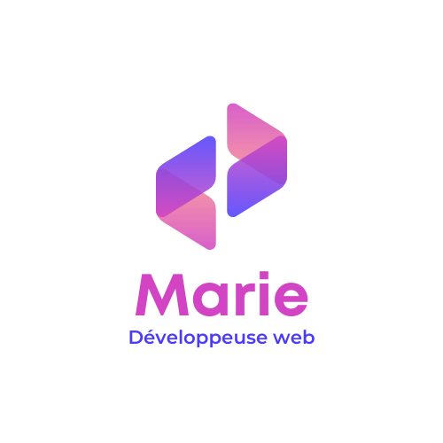

<!-- PROJECT LOGO -->
 

  
<h3 align="center">Marie Gautron</h3>
  

    Discover my universe, my projects, my articles...
     
    <a href="https://github.com/mariegautron/portfolio"><strong>Explore the docs »</strong></a>
     
     
    <a href="https://github.com/mariegautron/portfolio">View website</a>
    
  

  <a>[![Next][Next.js]][Next-url]</a>
  

<!-- ABOUT THE PROJECT -->
## About The Project

<!-- GETTING STARTED -->
## Getting Started

### Prerequisites

<!-- ROADMAP -->
## Roadmap

- [ ] Feature 1
- [ ] Feature 2
- [ ] Feature 3
    - [ ] Nested Feature

<!-- CONTACT -->
## Contact

Your Name - [@twitter_handle](https://twitter.com/twitter_handle) - email@email_client.com

Project Link: [https://github.com/mariegautron/portfolio](https://github.com/mariegautron/portfolio)

<!-- MARKDOWN LINKS & IMAGES -->
<!-- https://www.markdownguide.org/basic-syntax/#reference-style-links -->
[contributors-shield]: https://img.shields.io/github/contributors/mariegautron/portfolio.svg?style=for-the-badge
[contributors-url]: https://github.com/mariegautron/portfolio/graphs/contributors
[forks-shield]: https://img.shields.io/github/forks/mariegautron/portfolio.svg?style=for-the-badge
[forks-url]: https://github.com/mariegautron/portfolio/network/members
[stars-shield]: https://img.shields.io/github/stars/mariegautron/portfolio.svg?style=for-the-badge
[stars-url]: https://github.com/mariegautron/portfolio/stargazers
[issues-shield]: https://img.shields.io/github/issues/mariegautron/portfolio.svg?style=for-the-badge
[issues-url]: https://github.com/mariegautron/portfolio/issues
[license-shield]: https://img.shields.io/github/license/mariegautron/portfolio.svg?style=for-the-badge
[license-url]: https://github.com/mariegautron/portfolio/blob/master/LICENSE.txt
[linkedin-shield]: https://img.shields.io/badge/-LinkedIn-black.svg?style=for-the-badge&logo=linkedin&colorB=555
[linkedin-url]: https://linkedin.com/in/linkedin_username
[product-screenshot]: images/screenshot.png
[Next.js]: https://img.shields.io/badge/next.js-000000?logo=nextdotjs&logoColor=white
[Next-url]: https://nextjs.org/
